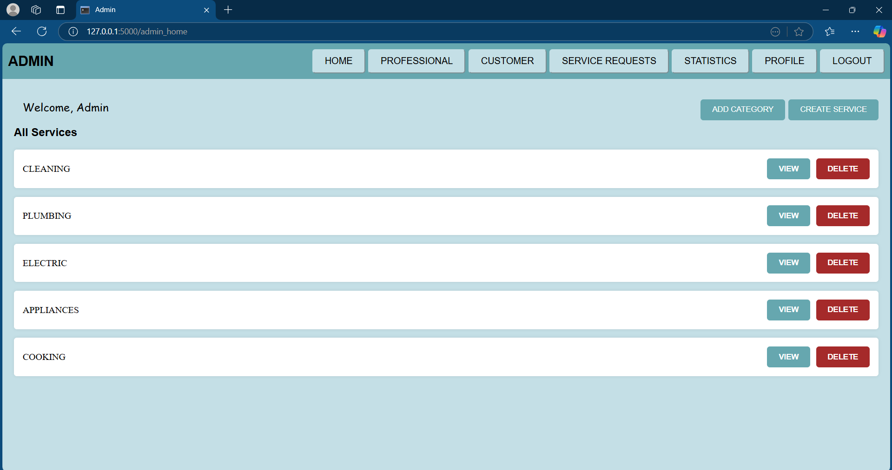
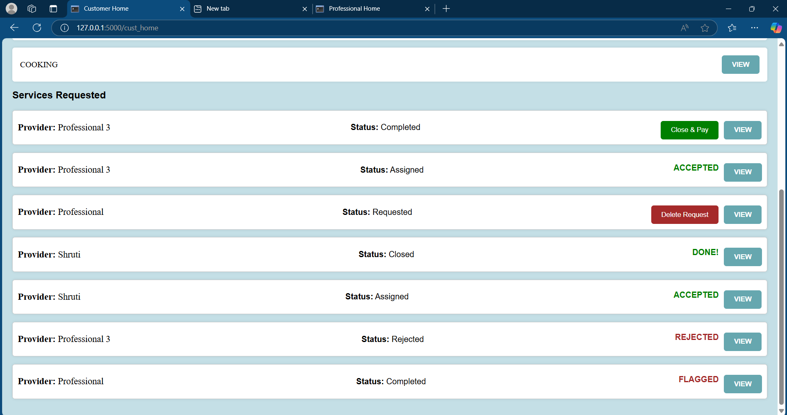

# 🏠 A_Z Household Services

A_Z Household Services is a user-friendly platform connecting 🧑‍🤝‍🧑 **Customers** with 👷‍♂️ **Service Professionals**, enabling seamless service booking, management, and feedback. Built with **HTML**, **CSS**, **Jinja2**, and **Flask**, the platform provides unique functionalities for **Admin**, **Service Professionals**, and **Customers**, ensuring a smooth and efficient user experience.

---

## ✨ Features

### 👑 Admin
- **Dashboard**: 🖥️ Manage categories, subtypes, and users.
- **Category Management**: 📂 Add, view, and delete service categories and subtypes.
- **Base Pricing**: 💰 Define and set base prices for different services.
- **Service Approval**: ✅ Approve or reject Service Professional registrations.
- **User Monitoring**: 👀 Monitor user activity and block/unblock accounts.
- **Requests Overview**: 📋 View all service requests and monitor their statuses.
- **Find Section**:
  - 🔍 Search for customers, service professionals, and service requests.
- **Statistics**:
  - 📊 Analyze platform usage, service trends, and user activity.

---

### 👷‍♂️ Service Professional
- **Profile Management**: 📝 Update personal details and service offerings.
- **Service Slots**: ⏰ Define and manage available time slots for services.
- **Request Management**:
  - 📥 View incoming service requests.
  - ✅ Accept or ❌ reject requests based on availability.
  - 🔒 Close service requests once completed (only if the service date has arrived).
- **Find Section**:
  - 🔍 Search for customers who have requested their services.
- **Statistics**:
  - 📊 View data on completed requests, earnings, and ratings.
- **Ratings and Reviews**:
  - 🌟 View customer reviews to improve service offerings.

---

### 🧑‍🤝‍🧑 Customer
- **Service Booking**:
  - 🔍 Browse services by category, subtype, location, or pincode.
  - 🛒 Book services for available time slots.
  - 📅 View upcoming bookings and their status.
- **Request Status**:
  - 🕒 If the service date has not yet arrived, the request status displays **Upcoming**.
  - ✅ Once the date arrives, the Service Professional can close the request after completion.
- **Professional Visibility**:
  - 📍 Customers can only view Service Professionals with the same pincode as theirs.
- **Find Section**:
  - 🔍 Search for Service Professionals by category, pincode, or service ratings.
- **Statistics**:
  - 📊 Analyze booking history, reviews, and service trends.
- **Feedback**:
  - ✍️ Post reviews and ratings for Service Professionals.
  - 🌟 View ratings and reviews before booking.

---

## 🛠️ Workflow

1. **Admin Actions**:
   - Create and manage service categories and subtypes.
   - Approve Service Professional registrations.
   - Search for users and service requests via the **Find Section**.
   - Monitor platform statistics.
2. **Service Professional Actions**:
   - Define service slots and manage service requests.
   - Search for relevant customer requests via the **Find Section**.
   - Analyze their performance and earnings using the **Statistics Section**.
3. **Customer Actions**:
   - Book services from professionals in the same pincode.
   - Search for Service Professionals via the **Find Section**.
   - View booking and review statistics in the **Statistics Section**.

---

## 📆 Date-Sensitive Logic

- **Upcoming Requests**:  
  If the service date has not yet arrived, the status is displayed as **Coming Date**.  
- **Closing Requests**:  
  On or after the service date, Service Professionals can **close** the request upon completion.

---

## 🚀 Technologies Used
- **Frontend**: HTML, CSS, Jinja2
- **Backend**: Flask (Python)
- **Database**: SQLite (SQLAlchemy)

---


## 📂 Screenshots

Below are the screenshots showcasing the features and functionalities of the A_Z Household Services platform:

### 🏠 Home Page


### 🔑 Login Page


### 🔍 Service Professional Search


### 🧑‍💻 Service Professional Home


### 👤 Service Professional Profile


### 📊 Service Professional Statistics


### 📝 Service Professional Registration


### 📋 Admin Categories Management


### 👥 Admin Customer Management


### 🏠 Admin Home Page


### 🚪 Admin Logout


### 👤 Admin Profile


### 👩‍💻 Admin Service Professional Management


### 📝 Admin Service Request Management


### 📊 Admin Statistics (1)


### 📊 Admin Statistics (2)


### 🧾 Admin Subtypes Management


### 📚 Customer Booking Page


### 🔍 Customer Search for Professionals


### 🏠 Customer Home Page


### 👤 Customer Profile


### 👨‍🔧 Customer Service Professional Details


### 📝 Customer Registration


### 🧾 Customer Service Request


### 💸 Customer Review and Payment


### 📊 Customer Statistics


### 🧑‍🔧 Customer Service Subtype


---
## 📸 How to Run the Project

1. Clone the repository:
   ```bash
   git clone https://github.com/your-repo/a-z-household-services.git
   ```
2. Navigate to the project directory:
   ```bash
   cd a-z-household-services
   ```
3. Install the required dependencies:
   ```bash
   pip install -r requirements.txt
   ```
4. Run the Flask server:
   ```bash
   flask run
   ```
5. Open your browser and navigate to `http://127.0.0.1:5000`.

---

## 📬 Contact
For any queries or feedback, reach out at **[My Email](mailto:khantalshreya@gmail.com)**.
